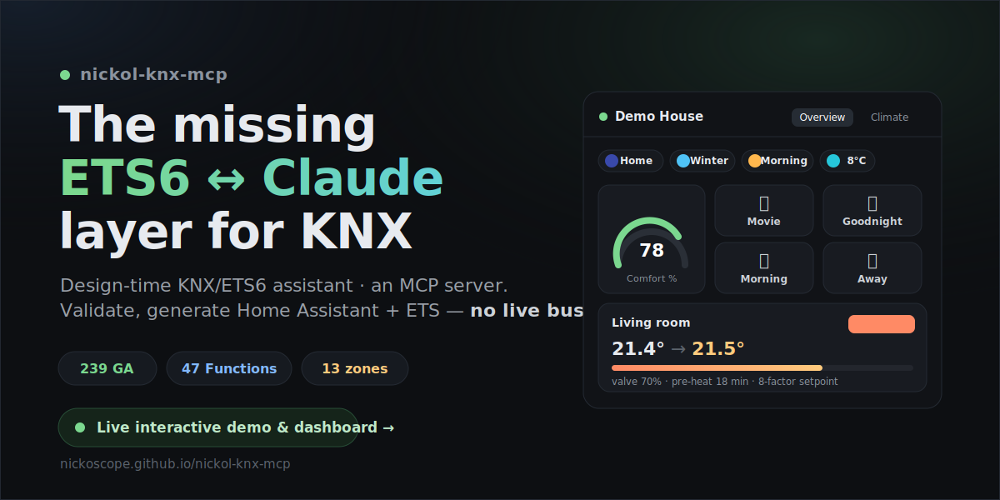
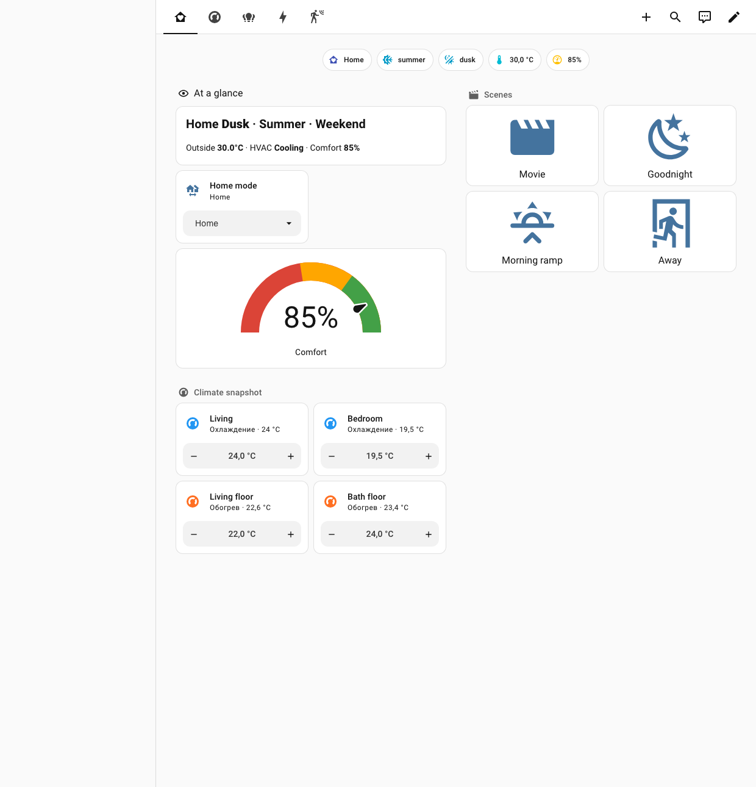
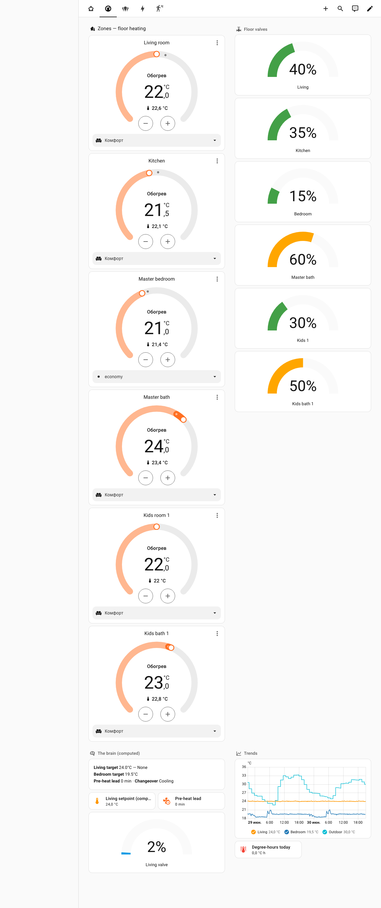
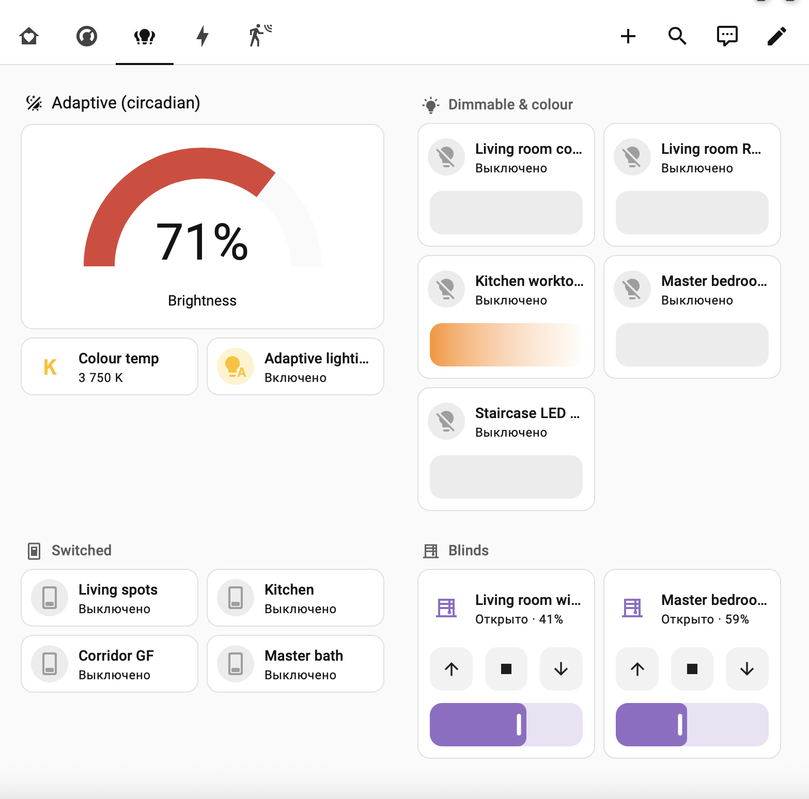
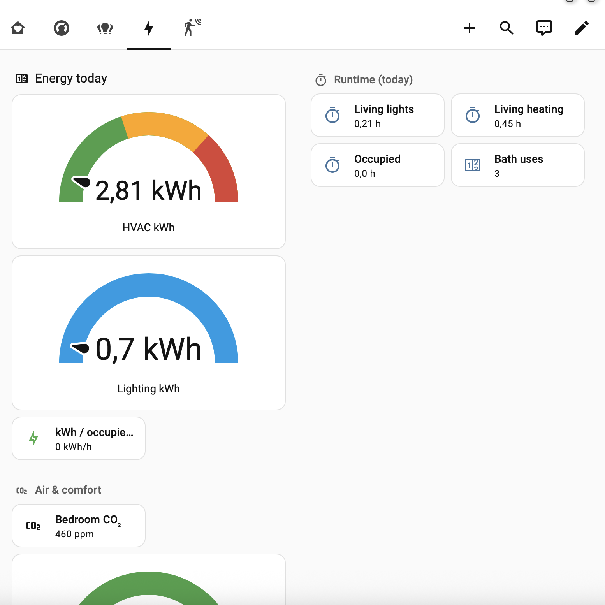
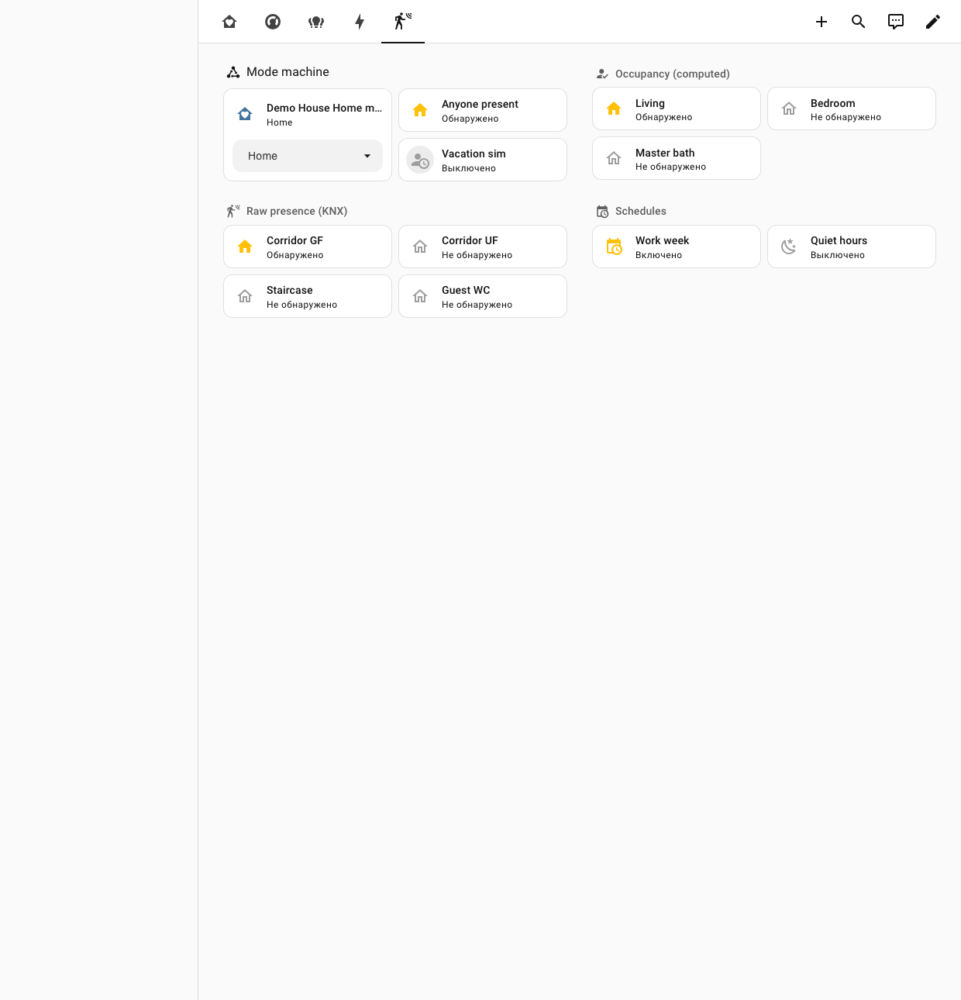

> 🌍 **English version:** [README.md](README.md) · Русская версия ниже.

# nickol-knx-mcp

**Design-time ассистент KNX/ETS6 в виде MCP-сервера.**

Три задачи, которые он решает — **никогда не подключаясь к живой шине KNX**:

1. **Спроектировать проект из ТЗ** — превратить спецификацию оборудования в полную валидную структуру групповых адресов **плюс весь комплект документов для реализации** (ETS-импорт XML/CSV, человекочитаемый отчёт, Home Assistant YAML, протокол приёмки, пакет сдачи as-built).
2. **Проверить, починить и довести готовый проект** — валидация (именование · DPT и sub-DPT · команда↔статус · KNX Secure · Matter-готовность), **конкретные предложения фиксов** (вывод DPT, синтез статусных адресов), грейд полноты, семантический дифф двух версий.
3. **Сгенерировать слой умного дома** — собранные сущности Home Assistant (цветной свет, климат, шторы, датчики), читающие *реальное состояние устройств*; всё неоднозначное — на человеческое ревью.

Под капотом — **библиотека устройств**, раскладывающая каждый актуатор на его реальные объекты связи: от типовых рецептов до **точной вендорской модели**, распарсенной прямо из application programs ETS.

[](https://glama.ai/mcp/servers/NickoScope/nickol-knx-mcp)
[-0b3d2e)](docs/case-study.ru.md)

> ⚠️ **Статус: BETA.** Пайплайн проходит end-to-end тест на синтетическом проекте и проверен на **реальных ETS5/ETS6 проектах на тысячи групповых адресов** (анонимизированных) — но реальные `.knxproj` очень разнообразны, и полевые отчёты делают инструмент лучше. Нужны тестировщики — см. [CONTRIBUTING.md](CONTRIBUTING.md).
>
> 💬 **[Присоединяйтесь к обсуждению →](https://github.com/NickoScope/nickol-knx-mcp/discussions/1)** — вопросы, идеи, и что инструмент нашёл на вашем проекте.

---

<p align="center">
  <a href="https://nickoscope.github.io/nickol-knx-mcp/">
    
  </a>
</p>

<h3 align="center">🎬 <a href="https://nickoscope.github.io/nickol-knx-mcp/">Живое интерактивное демо и дашборд&nbsp;→</a></h3>

> **Новое — целый демо-дом.** В [`examples/demo-home`](examples/demo-home) лежит синтетический проект
> на **239 GA / 47 Functions**, сгенерированные тулом отчёт + конфиг Home Assistant + ETS-экспорт, и полноценный
> **«мозг»** умного дома — циркадный свет, **уставка климата из 8 факторов**, машина режимов
> присутствие/сезон/время и статистика — с **дашбордом на 5 страниц**. Всё на
> **[живом сайте&nbsp;↗](https://nickoscope.github.io/nickol-knx-mcp/)**.

---

## 🖥️ Дашборд — вживую в Home Assistant

Реальные скриншоты из живого Home Assistant с демо-домом. Видны собранные инструментом сущности:
**цветной свет RGBW / RGB / CCT**, **6 климат-зон тёплого пола** (уставка, режим, % клапана), **циркадная**
кривая освещения и **вычисляемая** уставка климата — не заданная вручную.

<p align="center">
  
</p>

| Climate | Lighting |
|:---:|:---:|
| [](docs/assets/screenshots/climate.png) | [](docs/assets/screenshots/lighting.png) |
| **Energy & stats** | **Presence** |
| [](docs/assets/screenshots/energy.png) | [](docs/assets/screenshots/presence.png) |

▶ **[Открыть интерактивно на сайте →](https://nickoscope.github.io/nickol-knx-mcp/)** · конфиг в [`examples/demo-home/ha-brain`](examples/demo-home/ha-brain)

---

## 1. Зачем это и где оно в общей схеме

На июнь 2026 готового официального **ETS6 ↔ Claude / MCP** инструмента не существует.
KNX Community в мае 2026 прямо просит такую интеграцию (изменение проектов, добавление/переименование устройств и group addresses через Claude/CLI). Этот пакет закрывает именно **design-time** слой — самый недостающий.

Полная рекомендованная схема — четыре слоя, и собирать с нуля нужно только один:

| Слой | Назначение | Что использовать | Собирать? |
|------|-----------|------------------|-----------|
| 1. Live | состояния, управление, отладка автоматизаций живого дома | **официальный Home Assistant MCP Server** + KNX (XKNX) integration | нет, уже есть |
| 2. **Design-time** | парсинг `.knxproj`, проверка DPT/именования/статусов + классификация назначения GA (снижение шума), генерация HA YAML (сборка цветного света + климата) и ETS XML/CSV | **`nickol-knx-mcp` (этот пакет)** | **ДА — это и есть пробел** |
| 3. Files + Git | YAML/CSV/XML, версионирование схемы адресов | стандартные filesystem + git MCP | нет, уже есть |
| 4. Skill | правила проектирования (структура GA, naming, DPT, сцены) | `CLAUDE.md` из этого пакета | нет, готов |

> **Принцип безопасности:** слой 2 (этот сервер) **физически не умеет** подключаться к шине. У него нет ни одной сетевой/bus-зависимости — только чтение `.knxproj` и запись файлов в изолированный workspace. Требование «никогда не писать в живую шину» выполнено **структурно**, а не «честным словом». Любое реальное взаимодействие с домом идёт только через слой 1 (Home Assistant).

---

## 2. Что можно делать

### 📐 Сценарий 1 — проект с нуля: из ТЗ → комплект для реализации

Из спецификации проекта (ведомости оборудования, кабельные журналы, список изделий) — полная
валидная структура групповых адресов и **весь комплект документов**:

1. **Список устройств → модель объектов.** Каждое изделие раскладывается на реальные объекты связи
   через библиотеку устройств (`decompose_device`): канал диммера = вкл/выкл + статус +
   отн. диммирование (3.007) + абс. значение (5.001) + статус яркости — а не «один адрес»;
   зона тёплого пола = 8 объектов; импульсный счётчик = 6.
2. **Профессиональный логический слой.** В голом ТЗ никогда не написано то, что делает проект
   *завершённым*: центральные и зонные макросы, сцены, логика присутствия, обвязка климата,
   шторы по солнцу/ветру, цепочки «протечка→кран», астро/метео и дата-время, резервы в каждом
   диапазоне. Методология кодирует эти паттерны полноты — они выведены из стандарта KNX Association,
   открытой документации производителей и изучения реальных профессиональных as-built проектов ETS
   (анонимизированных).
3. **Структура и дисциплина.** 3-уровневая адресация, именование «зона + функция», парность
   команда↔статус, DPT на каждом адресе.
4. **Выходной комплект** (каждый — одной командой): ETS-импорт **XML/CSV** · Markdown-**отчёт** ·
   **Home Assistant YAML** · функциональный **протокол приёмки** · **пакет сдачи as-built**
   (инвентаризация, карта GA, % покрытия статусами, Secure-постура, QA-находки, topology SVG).

Методология: [`docs/spec-to-structure.md`](docs/spec-to-structure.md). Проверено в поле:
реконструкция реального as-built проекта ETS (3 600+ адресов) из одного только ТЗ дала
**~92 % структурного совпадения** (таксономия, домены, логика автоматизации, распределение DPT)
при **нуле ошибок валидации** — оставшаяся дельта — это параметризация устройств интегратором,
которой в ТЗ просто нет.

### 🔍 Сценарий 2 — аудит, починка и доведение готового проекта

- **Чтение и классификация.** Парсит запароленные ETS5/ETS6 `.knxproj` через `xknxproject`;
  классифицирует каждый GA по категории (lighting / shutter / hvac / sensor / scene / energy /
  diagnostics) и виду (command / status / sensor) — по DPT + многоязычным (EN/DE/RU) ключевым
  словам. **Классификация назначения** (`functional` / `reserve` / `logic` / `scratch`) выводит
  намеренные заглушки из списков ошибок — отчёт не «кричит волки» (на реальном проекте 685 GA:
  ложных ошибок 29 → 6).
- **Валидация** (`analyze_all` — всё разом): именование и структура · отсутствующие статусные
  объекты (роли ETS Functions → парность имён → **позиционный пейринг** — параллельные статус-миддлы с именами 1:1 — и самоотчитывающиеся R+T объекты) · отсутствующие/несогласованные DPT
  **+ sub-DPT проверка** («температура» с DPT 5.001 — под подозрением) · диммеры только с
  относительным диммированием · постура KNX Secure (secure/plaintext, смешанные группы,
  чек-лист keyring — ключи никогда не читаются) · Matter-готовность · энергодомен.
- **Починка, а не только флаги** (`suggest_repairs`): вывести DPT из семантики имени, исправить
  подозрительный sub-DPT, синтезировать статусный GA в свободном слоте, добавить адрес абсолютной
  яркости. Только предложения — человек ревьюит, принятое уходит в ETS-экспорт. На реальном
  проекте 3 646 GA: **145 конкретных предложений** (32 вывода DPT, 112 синтезированных статусов).
- **Доведение до конца**: `grade_completeness` (скелет → as-built), `suggest_names`,
  `diff_projects` (семантический дифф ревизий: added / removed / DPT-changed / renamed /
  secure-changed), затем свежий отчёт, пакет сдачи и протокол приёмки.

### 🏠 Сценарий 3 — слой умного дома (Home Assistant)

- **Собранные сущности, консервативно**: шторы → **цветной / диммируемый свет** (вкл/выкл +
  яркость + RGBW/RGB/цветовая температура + статусы) → выключатели → **климат** (текущая t°,
  статус уставки, режим, % клапана) → датчики. Каждой сущности — `state_address` везде, где
  устройство умеет отчитываться: HA читает *реальное состояние*, а не предполагает.
- **Сначала ревью**: всё неоднозначное (DPT 5.001 — яркость или позиция шторы?) **не угадывается** —
  уходит в список `review` с пояснением (включая зависящие от привода флаги штор —
  `invert_position`, времена хода, — которых в `.knxproj` нет).
- **Дополнительно**: `expose`-блок даты/времени на шину (DPT 19.001), Matter-линт,
  семантический экспорт KNX IoT (Turtle/RDF).
- Живое управление домом остаётся в официальной интеграции Home Assistant (слой 1) — этот сервер
  только готовит её конфигурацию.

### 🧩 Фундамент — растущая библиотека устройств

- `parse_devices_from_project` извлекает **точные вендорские модели объектов** — включая вендоров с публикацией на **ref-уровне** (`ComObjectRef`): HDL/Ekinex — из application
  programs внутри любого `.knxproj` / `.knxprod`: номера объектов, имена, размеры, DPT, флаги
  C/R/W/T/U, страйды канальных блоков — детерминированно и PII-безопасно (только вендорские
  данные каталога; клиентская часть файла не читается).
- Укажите `NICKOL_KNX_CATALOG` — и `decompose_device` отвечает **точной моделью**
  (`catalog-exact`) вместо типового рецепта. Каталог растёт по требованию — из проектов и
  продуктовых баз, которые *вы* ему даёте.
- Объекты, у которых производитель не объявил DPT, честно остаются `unverified` — никогда не
  угадываются.

Все записи идут только в каталог workspace (`NICKOL_KNX_WORKSPACE`, по умолчанию `./knx-workspace`); запись за его пределы отклоняется.

---

## 3. Установка

Требуется Python 3.10+.

```bash
git clone https://github.com/NickoScope/nickol-knx-mcp.git
cd nickol-knx-mcp
python3 -m venv .venv && source .venv/bin/activate
pip install -e .
```

Зависимости: `mcp>=1.10`, `xknxproject>=3.8`, `PyYAML>=6.0`.

> Если на Debian/Ubuntu система ругается на externally-managed окружение — используйте venv, либо `pip install -e . --break-system-packages`. При конфликте `PyJWT` помогает `pip install mcp --ignore-installed PyJWT`.

Проверка:

```bash
python tests/test_pipeline.py     # синтетический проект из 16 GA, end-to-end smoke test
nickol-knx-mcp                    # запустить MCP-сервер (stdio)
```

---

## 4. Подключение к Claude

### Claude Desktop

`examples/claude_desktop_config.json` уже сводит вместе nickol-knx + filesystem + git + home-assistant. Минимальный фрагмент:

```json
{
  "mcpServers": {
    "nickol-knx": {
      "command": "nickol-knx-mcp",
      "env": { "NICKOL_KNX_WORKSPACE": "/path/to/your/knx-workspace" }
    }
  }
}
```

### Claude Code

```bash
claude mcp add nickol-knx -e NICKOL_KNX_WORKSPACE="$HOME/knx-workspace" -- /abs/path/to/.venv/bin/nickol-knx-mcp
```

Положите `CLAUDE.md` в корень проекта — он работает как ETS Assistant skill (правила проектирования, safety-rules, 3-уровневая структура GA, command/status, DPT-дисциплина, naming, KNX Secure keyring, рабочий процесс).

---

## 5. Инструменты MCP (25)

**Чтение:** `load_project` · `list_group_addresses` · `get_devices` · `get_topology`

**Валидация:** `check_naming` · `check_missing_status` · `check_dpt` (+ **sub-DPT** проверка) · `check_secure` (KNX Secure posture + keyring-чеклист) · `check_matter` (Matter-готовность) · `check_energy` (энергодомен) · `analyze_all`

**Починка и дизайн:** `suggest_repairs` (**предлагает фиксы, а не только флагает**) · `suggest_names` · `decompose_device` (устройство → декомпозиция: **точная вендорская модель** из локального каталога или generic-рецепт) · `list_device_recipes` (device-library: Zennio + ABB) · `parse_devices_from_project` (**точные модели устройств** из app-programs `.knxproj`/`.knxprod` → YAML каталога) · `grade_completeness` (скелет vs as-built) · `diff_projects` (семантический дифф двух версий)

**Генерация:** `generate_ha_package` (цвет + климат + expose) · `generate_ets_group_addresses` · `generate_handover_pack` (пакет сдачи) · `generate_test_protocol` (протокол приёмки) · `generate_knx_iot` (Turtle/RDF) · `project_report` · `workspace_info`

<details><summary>Полная таблица (сигнатуры)</summary>

| Инструмент | Назначение |
|-----------|-----------|
| `load_project(path, password?, language?)` | загрузить и распарсить `.knxproj` (read-only), закэшировать |
| `list_group_addresses(category?, kind?)` | список GA с классификацией, фильтры |
| `get_devices()` | устройства + их communication objects |
| `get_topology()` | топология (areas / lines / devices) |
| `check_naming(name_regex?)` | проверка именования/структуры |
| `check_missing_status()` | актуаторы без статусного объекта |
| `check_dpt()` | отсутствующие/несогласованные DPT + sub-DPT |
| `check_secure()` | KNX Data Secure posture + keyring-чеклист |
| `check_matter()` | Matter-готовность функций |
| `check_energy()` | метеринг/энергодомен |
| `analyze_all(name_regex?)` | все проверки разом |
| `suggest_repairs()` | предложить фиксы для находок |
| `suggest_names()` | гигиена именования |
| `decompose_device(order_number, channels?)` | устройство → декомпозиция GA: **точная вендорская модель** из локального каталога (`NICKOL_KNX_CATALOG`) или generic-рецепт |
| `list_device_recipes()` | встроенная device-library |
| `parse_devices_from_project(path, output_path?, password?)` | извлечь **точные модели объектов устройств** из app-programs внутри `.knxproj`/`.knxprod` → YAML device-library (питает локальный каталог) |
| `grade_completeness()` | грейд полноты (скелет vs as-built) |
| `diff_projects(path_a, path_b, …)` | семантический дифф двух `.knxproj` |
| `generate_ha_package(output_path?)` | HA KNX YAML + список review |
| `generate_ets_group_addresses(fmt="xml"\|"csv", output_path?)` | ETS-импортируемые GA |
| `generate_handover_pack(output_dir?)` | пакет сдачи (as-built) |
| `generate_test_protocol(output_path?)` | протокол приёмки |
| `generate_knx_iot(output_path?)` | KNX IoT (Turtle/RDF) |
| `project_report(output_path?, name_regex?)` | Markdown-отчёт |
| `workspace_info()` | путь и содержимое workspace |

</details>

---

## 6. Типовой рабочий процесс

1. `load_project` → указать `.knxproj` (+ пароль, если запаролен).
2. `analyze_all` или `project_report` → прочитать находки, **сначала ревью человеком**.
3. Исправить именование/DPT/статусы в ETS (импортом сгенерированных GA или вручную).
4. `generate_ets_group_addresses(fmt="xml")` → импортировать в ETS как недостающие GA.
5. `generate_ha_package` → положить YAML в Home Assistant; разобрать `review`-элементы руками.
6. Всё (экспорт `.knxproj`, HA-конфиги, схема адресов) держать в Git.
7. Живой дом — только через Home Assistant MCP (слой 1).

---

## 7. Ограничения (честно)

- Классификация command/status и категорий — **эвристика** (DPT + имена + ETS Functions). На «грязных» проектах без Functions и с нестандартными именами возможны пропуски/ложные срабатывания — поэтому отчёт всегда для ревью человеком.
- DPT 5.001 структурно неоднозначен (яркость vs позиция) — разводится по ключевым словам; при нестандартном нейминге проверяйте вручную.
- Генератор HA консервативен: лучше отдать элемент в review, чем сгенерировать неверную сущность.
- Сервер не пишет в шину и не подключается к ETS напрямую — обмен с ETS только через файловый импорт/экспорт GA.
- **Тест пока только на синтетическом проекте.** Реальные `.knxproj` очень разнообразны — поэтому и нужны тестировщики.

---

## 8. Структура пакета

```
nickol-knx-mcp/
├── nickol_knx_mcp/
│   ├── dpt_map.py        # DPT → категория/вид/HA-платформа/value_type
│   ├── project.py        # ЕДИНСТВЕННЫЙ модуль, читающий .knxproj (read-only)
│   ├── pairing.py        # парность command↔status по токенам имени
│   ├── analyze.py        # naming / missing-status / DPT проверки
│   ├── generate_ha.py    # генерация HA KNX YAML
│   ├── generate_ets.py   # генерация ETS XML + CSV
│   ├── report.py         # Markdown-отчёт
│   └── server.py         # FastMCP сервер, 25 инструментов, confined writes
├── tests/test_pipeline.py
├── examples/claude_desktop_config.json
├── CLAUDE.md             # ETS Assistant skill / playbook
├── pyproject.toml
└── README.md
```

---

## Лицензия

[MIT](LICENSE) © 2026 Nikolay Miroshnichenko
